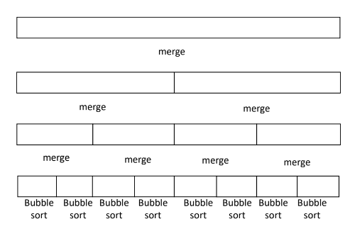
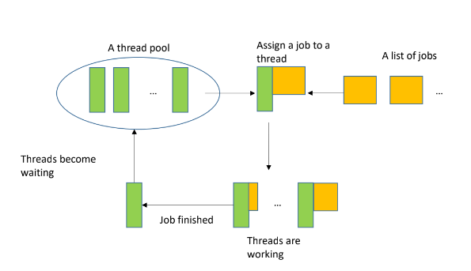
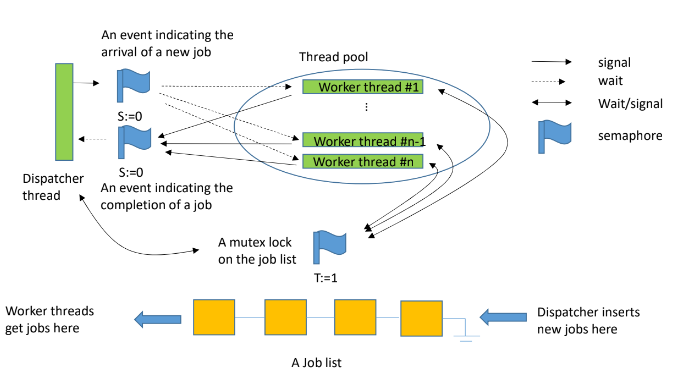
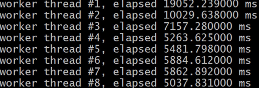

# HW3 - Parallel Merge Sort with Threads

## Overview
Jobs for Parallel Merge Sort \


The Concept of a Thread Pool \


## Semaphore
Synchronization tool that does not require busy waiting \
Semaphore S – integer variable \
• `Initial` value of S cannot be negative \
• Can only be accessed via these two indivisible (atomic) operations: `wait()` and `signal()` \
• An internal (invisible) waiting queue to manage blocked threads/processes

## Reference Design
Initially, the dispatcher thread inserts eight sort jobs for the eight bottom-level arrays and signals worker threads 

When a worker thread is signaled, it gets a job from the job list 

When a worker thread completes a job, it notifies the dispatcher 

When being notified, the dispatcher checks if any two pairing (buddy) sub-arrays have been sorted. If so, it inserts a new job of merging the 
two sub-arrays to the job list and signal a worker thread 



## Procedure
1. Read data from the input file “input.txt”
2. n=1
3. Do the sorting with a thread pool of n threads
4. Print the execution time
5. Write the sorted array to a file
> Filename: output_n.txt (e.g., output_3.txt if n=3)
6. n++; if n<=8 then goto 3

## Input and Output Format
Format of “input.txt”: \
< of elements of array > < space >\n \
All elements separated by space
    Largest input: 1,000,000 integers \
    Generate your own file for testing

Output file format “output_?.txt”:
< sorted array elements separated by space > \
On the screen 

 

In the output files: sorted integers

## APIs
```c
/*** Thread management ***/
#include <pthread.h> 
int pthread_attr_init(pthread_attr_t *attr);
int pthread_create(pthread_t *restrict thread, const pthread_attr_t *restrict attr, void *(*start_routine)(void *), void *restrict arg); 
void pthread_exit(void *retval);

/*** Semaphore operations ***/
#include <semaphore.h> 
int sem_init(sem_t *sem, int pshared, unsigned int value);
int sem_wait(sem_t *sem);
int sem_post(sem_t *sem);
int sem_getvalue(sem_t *restrict sem, int *restrict sval);
int sem_destroy(sem_t *sem);
```

## Note
Numbers must be sorted in the ascending order \
Use bubble sort on the bottom-level arrays \
All the 8 output files must be identical \
Avoid polling in any place of your program \
Jobs must be dynamically created. Do not pregenerate all jobs 

You get 0 mark if you use quicksort() in any place 

Execution time decreases as n increases, performance improve. And saturates when n is large
> Again! Why? Try googling “Amdahl's Law”

## Test your program
```bash
chmod +x test.sh
./test.sh
```