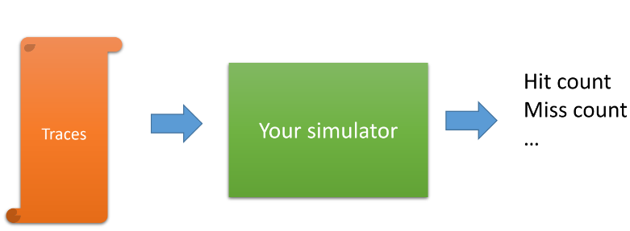
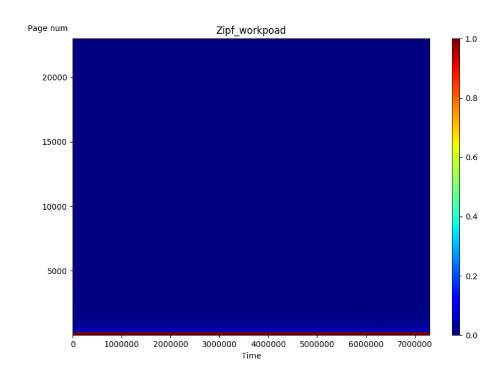
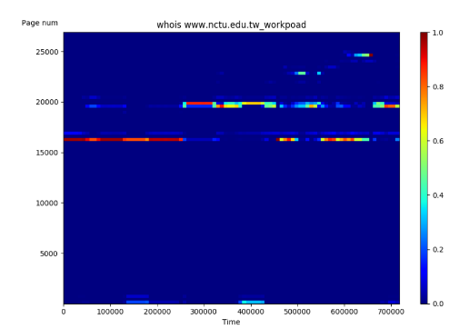
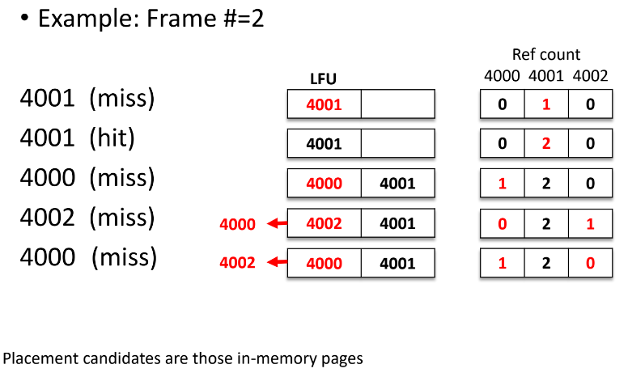
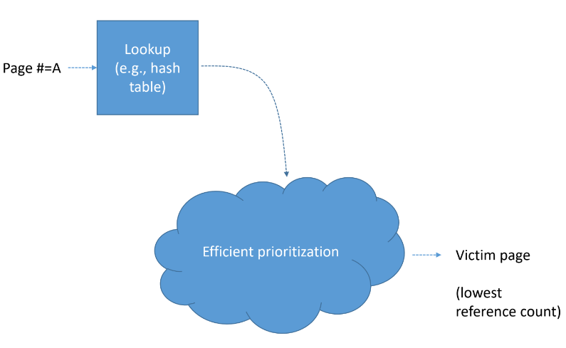
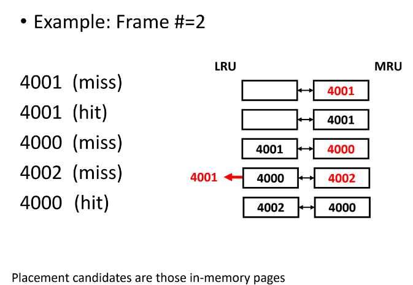
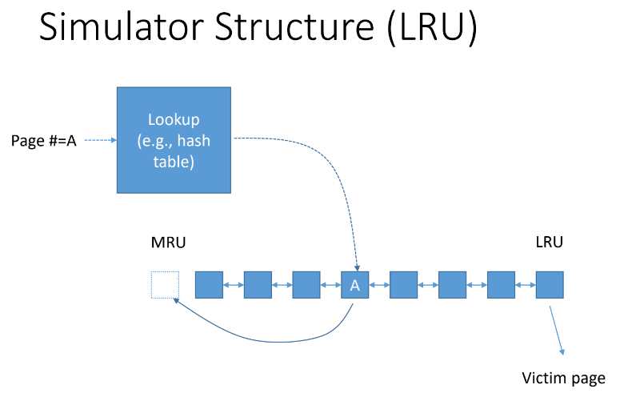

# HW5 - Page Replacement Simulation: LRU and LFU

## Overview

Trace File Format
- Page number of referenced pages (unsigned integer)
- Zipfian Distribution

- whois www.nctu.edu.tw

## LFU Simulator Structuew
Least Frequently Used

Least Recently Used

## Page Cache Operations
Page lookup
- Check whether or a new reference is a hit or a miss
- Hash tables, binary search trees, skip lists....

Do not use linear search!!! 

Do not use `map/unordered_map` from STL as they are poorly implemented and very slow.

## Victim Selection
LFU
- The least frequently used page
- If two pages have the same access count, the page having a smaller reference sequence number is replaced
- You may need to store the reference sequence number when a page is added to the page cache

LRU
- The least recently used page

## Procedure
1. Algorithm=LFU
2. For (frame # = 64, 128, 256, and 512) do
    - Read the trace file
    - Run simulation
    - Print out the hit count, miss count, page fault ratio
3. Print out the total elapsed time of Step 2
4. Algorithm=LRU
5. For (frame # = 64, 128, 256, and 512) do
    - Read the trace file
    - Run simulation
    - Print out the hit count, miss count, page fault ratio
6. Print out the total elapsed time of Step 5

## Note
Total request # <= 10 millions

Highest page address == 0xfffff

The path+file name of the trace file is an argument of your program (see the screen shot), do not hardcoding the pathname of thee trace file

For each iteration, you should open the file, run the simulation, print the result and close the file

Do not store the trace data in memory to speed up the next iteration

Use gettimeofday() to get the total elapsed time