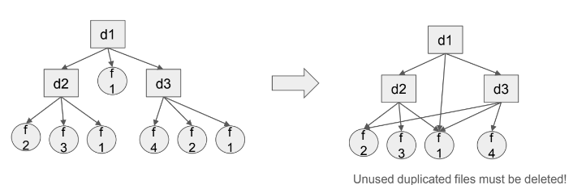

# HW6 - File Deduplication

## Overview
Design and Implementation of file deduplication

Skills to be learned from this assignment
- Directory traverse APIs
- File link APIs (hard link)
- File duplication detection method

File Deduplication

A critical technique for storage space saving; applications include
- Differential backup
- Virtual machine image management
- Git repository actually involves file deduplication as well

## Input and Output
Input: A directory of (many) files
- Provide an archive file; extract this file to generate the source directory

Output: The same directory with duplicate files replaced with hard links
- Perform in-place deduplication, i.e., dedup in the source directory



## How to Detect Duplicate Files
Two duplicate files have exactly the same contents, but may have different names, timestamps and they may appear in different directories

You are not allowed to do verbatim comparison among files as it is extremely slow and scales poorly

Unique files having the same size/name will be used for testing

### Hints
May need SHA1 APIs

Install necessary files with command `sudo apt install libssl-dev`

```c
#include <openssl/sha.h>

int SHA1_Init(SHA_CTX *c);
int SHA1_Update(SHA_CTX *c, const void *data, size_t len);
int SHA1_Final(unsigned char *md, SHA_CTX *c);
```

## Run Your Program
1. Extract test.tar.xz to some directory.
- `tar -xf ./test.tar.xz --directory=$DIRECTORY`

2. Execute your program with the directory name
- `./$EXECUTABLE $DIRECTORY`

3. For example
```bash
mkdir -p test
tar -xf ./test.tar.xz --directory=test
make
./main ./test
```

## Test Script
1. Put `your executable` and `demo.sh` in the same directory

2. Change `demo.sh` permission
- `chmod +x demo.sh`

3. Run the script
- `./demo.sh main`

This script will check your efficiency, file hard link counts and compare contents of all files